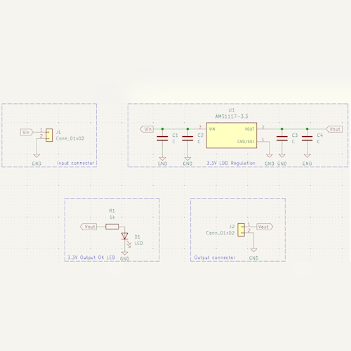
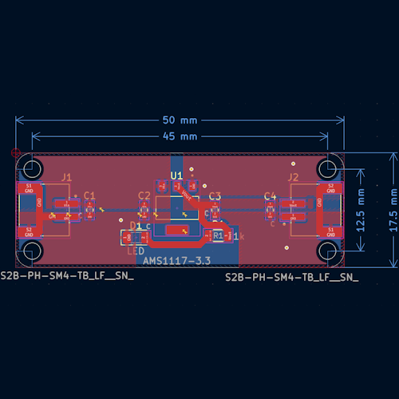
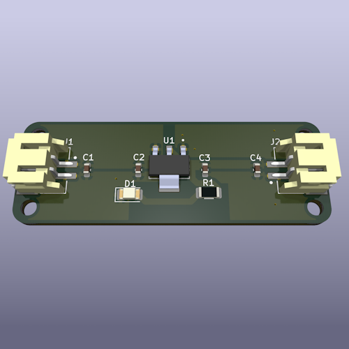

# HV2LV-PowerJST

## Overview
**HV2LV-PowerJST** is an open-source PCB designed to step down **4.8V - 15V** to a stable **3.3V** output using an **AMS1117 voltage regulator**. The board features **JST-PH connectors** for easy integration into embedded projects, IoT devices, and prototyping setups.  

Designed to fit **Adafruit’s standard PCB footprint**, this module ensures compact and reliable power regulation for various low-voltage applications.

## Purpose
- **Efficient power conversion**: Converts input voltages from **4.8V to 15V** down to a fixed **3.3V**.  
- **Compact and Adafruit-compatible**: Fits within Adafruit's standard PCB dimensions.  
- **Open-source and customizable**: Modify and adapt the design to suit your specific needs.  

## Features
| Feature         | Description |
|----------------|-------------|
| **Input Voltage** | 4.8V - 15V |
| **Output Voltage** | 3.3V (fixed) |
| **Regulator** | AMS1117-3.3 |
| **Connector 1** | JST-PH (Input Voltage) |
| **Connector 2** | JST-PH (3.3V Output) |
| **Capacitors** | 4 decoupling capacitors for stability |
| **PCB Design** | Open-source & customizable |
| **Use Cases** | Powering 3.3V embedded systems, IoT devices, and sensors |

## PCB Design Preview
| Schematic | PCB Layout | 3D |
|-----------|-----------|-----------|
|  |  |  |

## License
This project is open-source. Feel free to use, modify, and contribute!
